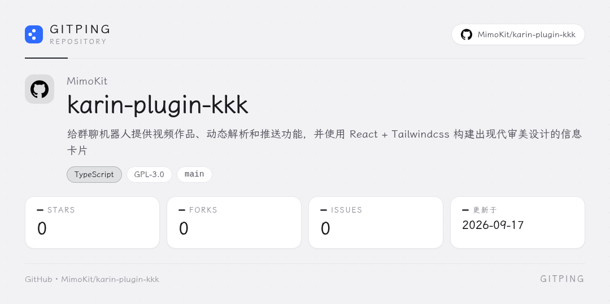
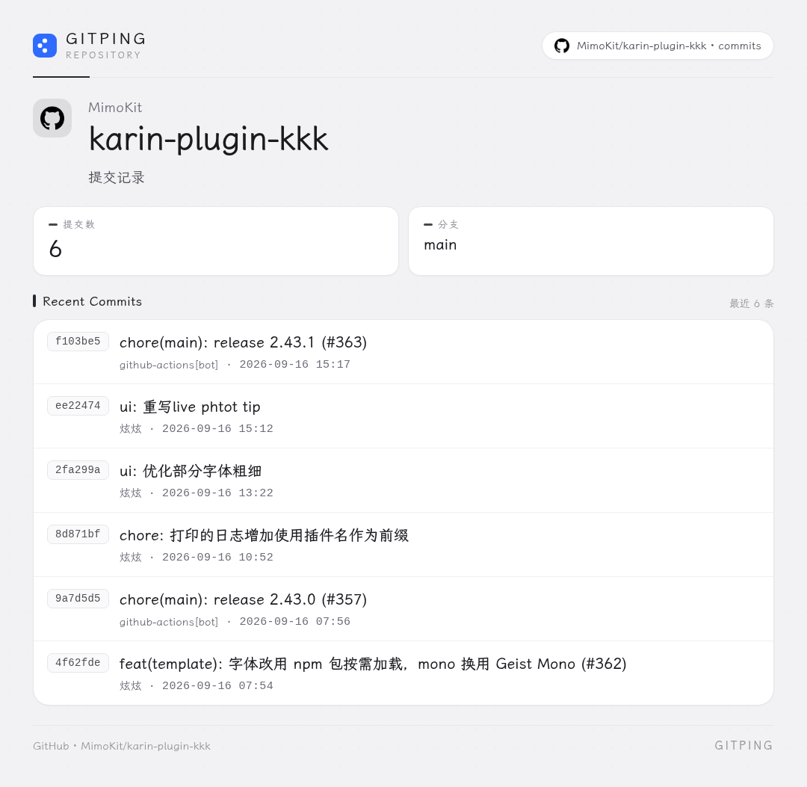
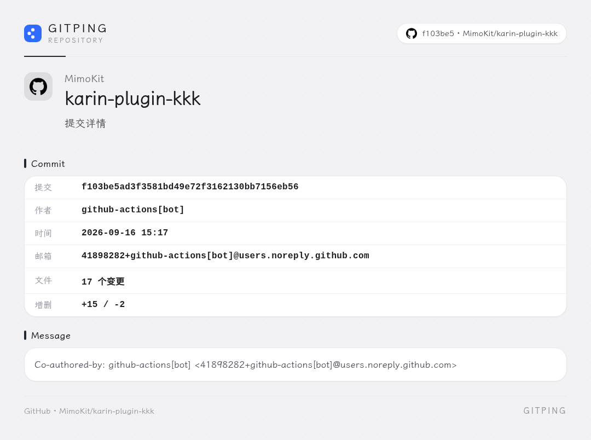
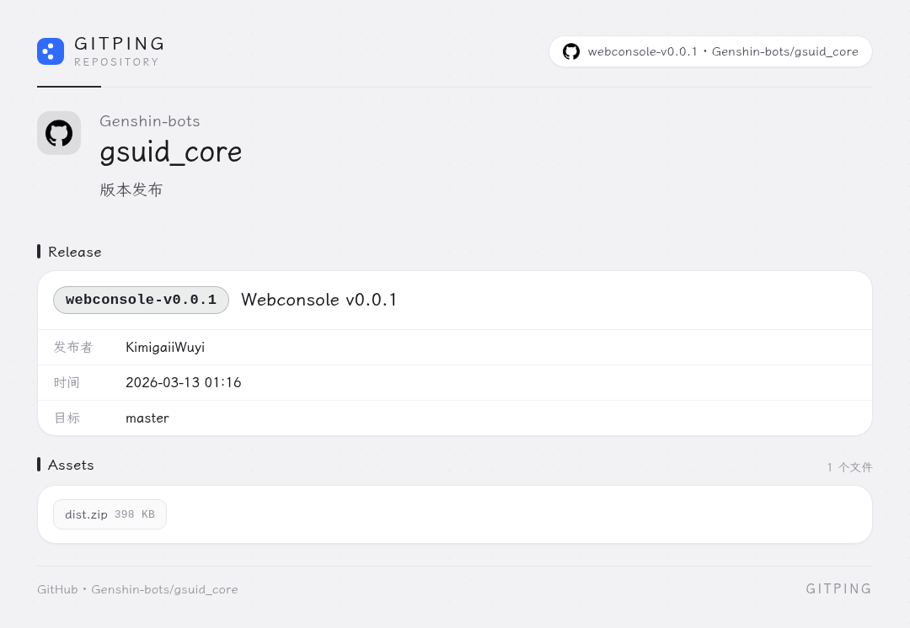

# GitPing

GsCore 的 Git 仓库查询与订阅插件。在群里直接查仓库信息、提交记录、版本发布，
也可以订阅某个仓库，有新提交或新版本时自动推送。

支持 **GitHub** / **Gitee** / **GitCode** / **CNB** 四个平台。

 

## 安装

### 方式一：聊天安装

连接 GsCore 后发送：

~~~text
core安装插件GitPing
core重启
~~~

### 方式二：手动克隆

~~~bash
cd /path/to/gsuid_core/gsuid_core/plugins
git clone https://github.com/MimoKit/GitPing.git
~~~

然后重启 GsCore。

 

## 指令

| 指令 | 说明 |
| :--- | :--- |
| `git仓库 [仓库]` | 查询仓库信息（星标、分支、语言、许可等） |
| `git提交 [数量] [仓库]` | 查看最近的提交记录 |
| `git提交详情 <sha> [仓库]` | 查看某条提交的详情 |
| `git版本 [tag] [仓库]` | 查看版本发布，含发布说明与资产列表 |
| `git绑定 [平台:]owner/repo` | 为当前群绑定默认仓库（主人/超管） |
| `git解绑` | 解除绑定（主人/超管） |
| `git当前仓库` | 查看本群绑定的仓库 |
| `git订阅 [仓库]` | 订阅更新推送（主人/超管，需先开启推送） |
| `git取消订阅 [仓库]` | 取消订阅（主人/超管） |
| `git订阅列表` | 查看本群订阅 |
| `git帮助` | 查看指令列表 |

**仓库参数的三种写法**，可放在参数任意位置：

~~~text
git仓库 MimoKit/GitPing                          省略平台，默认 GitHub
git仓库 github:MimoKit/GitPing                   显式指定平台
git仓库 https://gitee.com/foo/bar                从 URL 域名推断平台
~~~

绑定过默认仓库后，上面这些指令都可以不带仓库参数。

 

## 两套渲染方式

卡片渲染提供两条路径，在 Web 控制台的 `render_backend` 里切换：

| 取值 | 行为 | 依赖 |
| :--- | :--- | :--- |
| `browser` | 用 Playwright + 无头 Chromium 截图，排版最精确 | 需装 Chromium |
| `builtin` | 用 GsCore 自带的 `render_html_to_bytes`（pytakumi） | **零额外依赖** |
| `auto`（默认） | 优先浏览器，不可用时自动回退到内置 | 同上 |

两条路径**共用同一份 HTML 模板与样式**，出图观感基本一致。

用 `builtin` 时不需要装 Chromium，适合资源受限或不想引入浏览器的部署：

~~~bash
# 只要装了 GsCore 就能用，无需额外操作
~~~

用 `browser` 时，需要为 GsCore 所在的 Python 环境装一次浏览器：

~~~bash
pip install "playwright>=1.49.0"
python -m playwright install chromium
~~~

> 实测发现内置渲染器有两个限制，模板已针对性规避：不支持 `backdrop-filter`
> （因此不用毛玻璃），内联 `<svg>` 尺寸会失控（因此平台图标预渲染成 PNG，
> 并用 `background-image` 而非 `` 加载）。

 

## 配置

所有配置在 Web 控制台的 **GitPing** 项下。

| 配置键 | 默认值 | 说明 |
| :--- | :--- | :--- |
| `github_token` | 空 | 可选；查询公开仓库无需填写 |
| `gitee_token` | 空 | Gitee 私有仓库必需 |
| `gitcode_token` | 空 | GitCode 私有仓库必需 |
| `cnb_token` | 空 | CNB 私有仓库必需 |
| `request_timeout` | `15` | 调用平台 API 的超时（秒） |
| `render_backend` | `auto` | `auto` / `browser` / `builtin` |
| `render_quality` | `default` | `default`（1 倍图）/ `high`（2 倍图） |
| `commit_limit` | `5` | 提交记录默认条数 |
| `push_enabled` | 关 | 是否启用更新推送 |
| `push_interval` | `10` | 推送轮询间隔（分钟） |

> GitHub 未登录时也有每小时 60 次的 API 限额，频繁查询建议配一个令牌。

 

## 推送订阅

1. 在 Web 控制台打开 `push_enabled`
2. 群里发送 `git订阅 owner/repo`
3. 之后该仓库有新提交或新版本时自动推送卡片

首次订阅只记录当前进度、不推送历史内容，因此不会刚订阅就被刷屏。
每个群最多同时订阅 5 个仓库。.

订阅同时会登记到 GsCore 的订阅体系，可在 Web 控制台的订阅列表里看到。

 

## 效果

  <b>仓库信息</b> 
  

  <b>提交记录</b> 
  

  <b>提交详情</b> 
  

  <b>版本发布</b> 
  

卡片配色跟随平台品牌色变化，版式保持一致。

 

## 常见问题

| 现象 | 排查方向 |
| :--- | :--- |
| 提示仓库不存在 | 检查 owner/repo 拼写；私有仓库需要配置对应平台的令牌 |
| 提示拒绝了请求 | 令牌无效或权限不足；GitHub 令牌需要 `repo` 读权限 |
| 提示请求过于频繁 | 触发平台限流，稍后重试，或配置令牌提高额度 |
| Gitee 查询失败 | Gitee 多数接口需要令牌，请在控制台填入 `gitee_token` |
| 订阅没有推送 | 确认 `push_enabled` 已开启，且 Bot 在线 |
| 配置改了没生效 | 轮询间隔在启动时注册，改完需重启 Core |
| 出图为纯文字 | 渲染失败时插件会降级发文字，检查日志里的渲染错误 |

 

## 项目结构

~~~text
GitPing/
├── GitPing/
│   ├── gitping_core/
│   │   ├── platforms.py   四个平台的 API 适配与仓库引用解析
│   │   ├── store.py       绑定与订阅的持久化
│   │   ├── commands.py    命令注册与流程编排
│   │   └── scheduler.py   定时检查与推送
│   ├── gitping_render/
│   │   ├── canvas.py      双渲染后端（浏览器 / 内置）
│   │   ├── cards.py       四类卡片的构建
│   │   └── icons.py       平台图标与品牌色
│   └── gitping_config/    WebConsole 配置
├── templates/             HTML 模板与设计系统
├── resources/logos/       平台图标（PNG）
├── preview/               效果图
├── pyproject.toml
└── ruff.toml
~~~

 

## 许可

以 [GNU General Public License v3.0](./LICENSE) 开源。

平台图标来自 [simple-icons](https://github.com/simple-icons/simple-icons)（CC0）
与 [Arcticons](https://github.com/Arcticons-Team/Arcticons)（CC BY-SA 4.0）。
